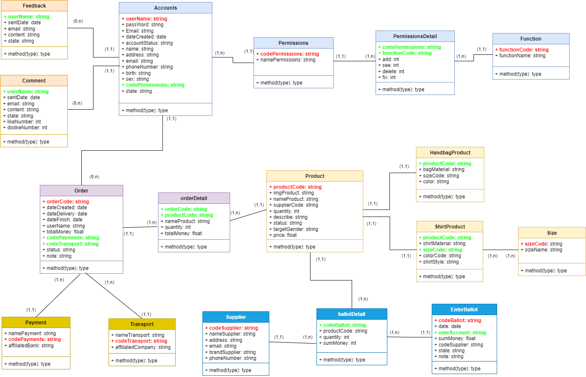

# Nhật ký làm web Website-sells-clothes-and-bags của nhóm

## Task 1 (4/3/2024 -> 23h:59p - 8/3/2024): Hoàn thành giao diện
- Link trang website: [website bán hàng Minimal](https://minimal.crv.vn/)
- Do để tránh khó khăn trong đồ án nên mình đã lượt **bỏ chức năng viết blog**
- **Mình đã viết trang HomePage,Header và Footer** để demo sẵn cấu trúc các thư mục rồi. Hiện giờ còn trang "**shop**", trang "**chi tiết sản phẩm**", trang "**contacts**" và trang "**cart**".

-  Trang **shop**:
   
   

   - **Lưu ý**: bỏ phần được đánh dấu màu xanh, còn lại code y như mẫu rên web (bao gồm hiệu ứng đầy đủ)
   - Làm thêm phần "**phân trang**" (lên youtube tìm hiểu)

- Trang **chi tiết sản phẩm**:
   

   - **Lưu ý**: bỏ phần được đánh dấu màu xanh, còn lại code y như mẫu rên web (bao gồm hiệu ứng đầy đủ). **Kéo toàn bộ nội dung chi tiết sản phẩm ra luôn phần bị xóa.**.
   - Làm cả phần **Description** và phần **Review** nha. (được đánh dấu màu xanh lá cây á).

- Trang **contacts**:
  

  - **Lưu ý**: làm y như mẫu trên web.

- Trang **cart**:
  

  - **Lưu ý**: làm y như mẫu trên web. Khi làm nên lên web thêm một sản phẩm bất kỳ vào vỏ hàng để làm theo cấu trúc. **Lúc có sản phẩm và lúc không có sản phẩm.**

- **Giao việc**:
  - Trang **shop**: Dũng
  - Trang **chi tiết sản phẩm**: Phát.
  - Trang **contacts** : Sang
  - Trang **cart** : Trí

- ## Lưu ý:
  - Các bạn lên githud để **tải toàn bộ thư mục về và làm trên máy các bạn**.
  - **Đến hạn các bạn đóng gói toàn bộ file project lại gửi cho mình trong nhóm zalo để mình tiến hành đẩy code lên**. Tránh trường hợp merge dẫn đến xung đột code.
  - Nếu có lỡ đẩy code lên làm thư mục gốc bị lỗi thì báo mình để mình reset lại nha.

- ## Kết quả hoàn thành task 1: một số lưu ý 
  - Trang **cart**, **chi tiết sản phẩm**, **contacts us**,**shop** đã hoàn thành tốt
  - Trong quá trình làm **có hình ảnh**, mấy phen **nên tải ảnh đó về lưu vào đúng thư mục trong thư mục image** để tiện thao tác chứ **không nên link ảnh đến trang web đó** dễ bị lỗi.
  - Tớ **đã push toàn bộ file các trang hoàn thành tốt lên githud**. Các bạn có thể pull về để kiểm tra xem có sai sót gì không.
  - **Nếu có sai xót gì các bạn nhớ báo tớ trong nhóm zalo nha.**

## Task 2 (từ 18h:46p 9/3/2024 -> 23h:59p - 15/3/2024): Tìm kiếm và đề suất form đăng nhập, đăng ký và giao diện trang admin. Thiết kế lớp DTO và DAO + các bản csdl cơ bản.

- Mỗi người hãy tìm kiếm và đề suất form đăng ký, đăng nhập và giao diện admin. Về form đăng nhập đăng ký, có thể tham khảo web nào cũng được nha (có link web càng tốt), còn về giao diện admin thì mấy phen tham khảo mấy đồ án mà mấy phen từng tham gia xem có cái nào đẹp đẹp hong nha.

- Sau khi kiếm được mẫu sẽ code sau.

- Đây là hình ảnh sơ đồ cở sở dữ liệu của nhóm (đã được thầy Sang tư vấn): 
   

- Có gì tớ thiết kế sơ đối tượng trong lớp DTO với lớp DAO rồi push lên để anh em tham khảo nha, có gì góp ý chung.

- ## Giao việc:
  - **Tìm kiếm và đề xuất hình ảnh về form đăng nhập, đăng ký và giao diện** : Phát, Sang, Dũng, Trí.
  - **Code form đăng nhập, đăng ký**: ?
  - **Thiết kế cơ bản DTO, DAO + CSDL**: Apu  

